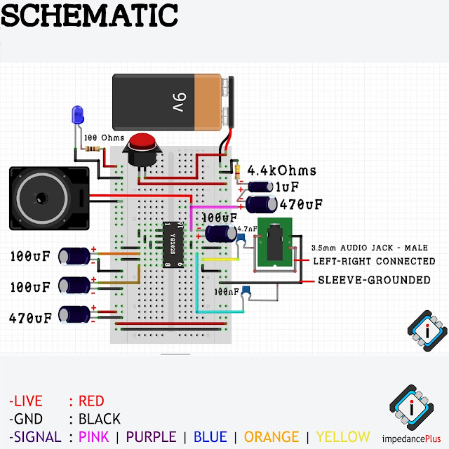

# Dual Axis Solar Tracker

An Arduino based embedded system project, that is able to track the direction from which the light is comming and rotate it self autoamtically. 
### Use Case 
- Maximizing Efficiency for solar charging
### Project Status
- Current Version: V1.0

## Features
- Dual Axis orientation
- Arduino based
- Charges a Li-ion Battery

## Demo
[Watch-Demo](www.youtube.com) 

## Getting Started
- Knowledge Required : C/C++, sensor-modules, basic Circuiting & design

## Hardware Requirements
- Arduino Nano, 1602 LCD 
- Sensors : DHT11, Water, LDR sensors
- SG90 Servo Motor, Solar Panel
- Leds, Buzzer, Res, Cap, TP4056, 7805
- Battery : 3.7v 18650 Li-ion, 9V alkaline
- Wires, Soldering, Glue, Tape etc

## Software Requirements
- Arduino IDE
- C/C++ Programming Language
- Necessary Libraries

## Schematic



## Installation
```
git clone https://github.com/pointer2Alvee/embd-sys-dual-axis-solar-tracker.git 
cd your-repo  
```

## Usage
Upload sketch via Arduino IDE for Embedded projects  

## Roadmap
- [x]  Initial release with basic functionalities.
- [ ]  Add support for IoT device integration.
- [ ]  Develop mobile app interface for remote control.
- [ ]  Enhance documentation and add tutorials.

Contributions are welcomed!

+ Fork the repo. 
+ Create a branch: git checkout -b feature/YourFeature.
+ Commit changes: git commit -m 'Add some feature'.
+ Push to branch: git push origin feature/YourFeature.
+ Open a Pull Request.
## License

Distributed under the MIT License. See LICENSE.txt for more information.

## Acknowledgements
- Libraries-Frameworks Used : DHT11, Servo
